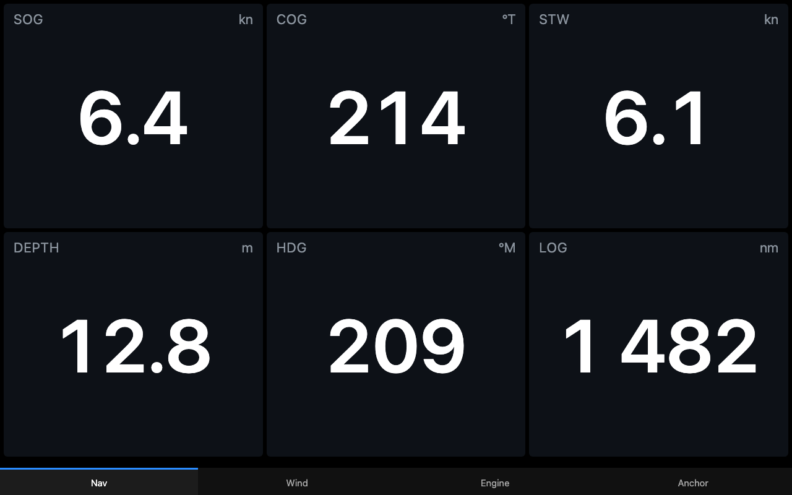

# signalk-simple-switcher

A minimal Signal K webapp that shows a row of tabs (top or bottom) for switching
between other webapps or any web page. No build step, no dependencies, one HTML file.

## Why

On a boat you often want a screen, whether a helm tablet, phone or mast display, to
flip between a few instrument pages with one tap. Existing app switchers use icon
grids and docks, which look nice but add taps, screen clutter and weight. This does one thing:
a plain row of labelled tabs.

- **Simple**: a strip of tabs, nothing else on screen.
- **Fast**: pages stay loaded in the background, so switching is instant.
- **Works everywhere**: plain HTML and old-style JavaScript, so it runs on old
  tablets and any modern browser.
- **Pages, not just apps**: add the same webapp more than once (e.g. two
  `signalk-bignumbers` tabs as two "pages"), or any other URL on your network.

## Setup

1. Install from the Signal K App Store (or `npm install` into `~/.signalk`) and restart the server.
2. **Server → Plugin Config → Simple Switcher**:
   - **Tab bar position**: `bottom` or `top`.
   - **Keep pages loaded**: on = instant switching (all visited pages stay alive);
     off = each page reloads when selected (lighter on old tablets).
   - **Tabs**: add as many as you like. For each, pick an installed **Webapp** or
     **Custom URL**, and give it a **Label**.
     - Custom URL: put the full address in **URL** (e.g. `http://192.168.1.10:3000/`).
     - Webapp: **URL** is optional and appended to the webapp's path
       (e.g. `#2` or `?layout=b`), useful if the app supports it.
   - The same webapp can be added more than once.
3. Open `http://<server>:3000/signalk-simple-switcher/`.

## Notes

- Deep link to a tab with `#1`, `#2`, … on the URL. Otherwise the last used tab is remembered per device.
- The page picks up config changes on reload.
- Pages are shown in iframes. External sites that forbid framing (`X-Frame-Options` /
  `frame-ancestors`) will show blank — nothing this plugin can do about that.
- Two tabs of the same webapp share its browser storage (same origin), so apps that
  keep their layout in `localStorage` will show the same layout in both unless the
  app supports a per-URL setting.

## License

Apache-2.0
