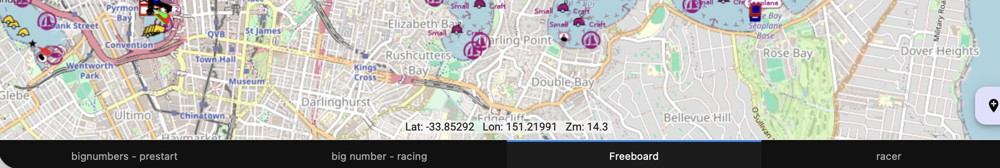
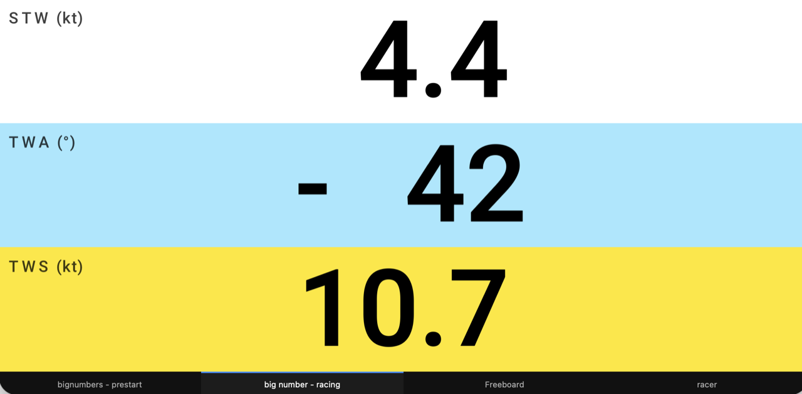
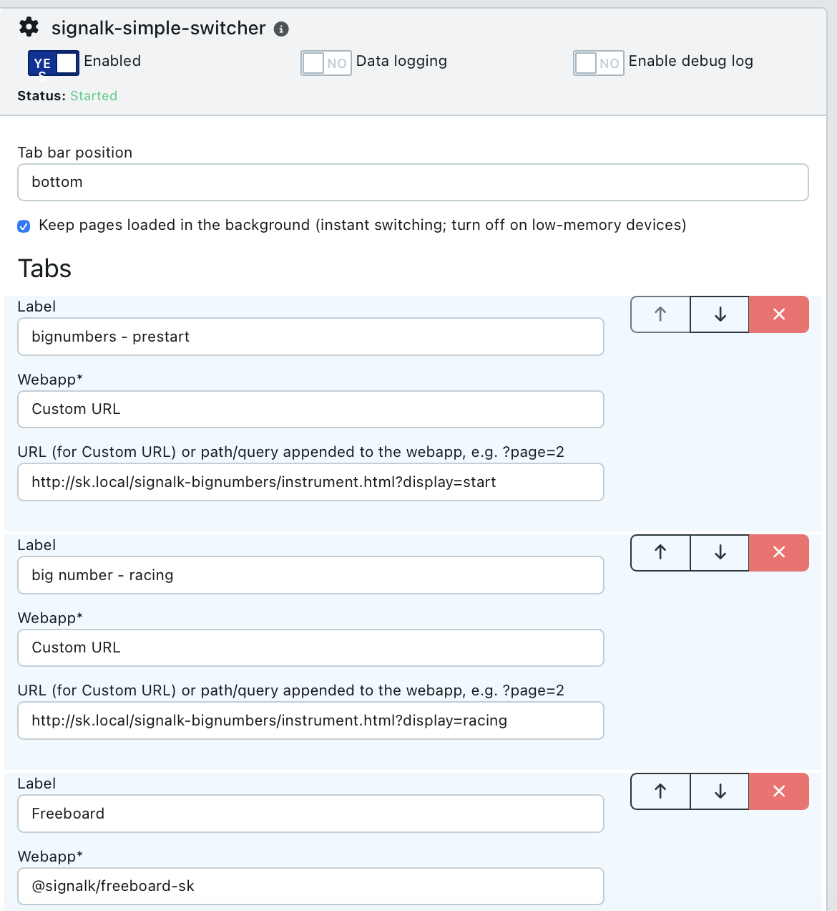

# Simple Switcher for Signal K

A row of tabs for switching between Signal K webapps, or any web page, with one
tap. Made for a helm tablet, phone or mast display that has to show a few
different pages.

## Why

One screen on a boat often has to show a chart, a page of big numbers and a race
timer. Signal K has webapps for all of these, but moving between them means going
back to a launcher or icon grid. That's extra taps on a small screen that's hard
to read in spray and sunshine. Simple Switcher keeps your pages one tap apart and
gives the rest of the screen to them.

- **One tap.** The tabs are always on screen, with no menus or icon grids.
- **Instant.** Pages stay loaded in the background, so switching doesn't reload
  anything and live data keeps updating.
- **Pages, not just apps.** Add the same webapp more than once with different
  settings. Above, one big-numbers app is two tabs: *prestart* and *racing*.
- **Any web page.** A tab can be any address on your network, such as a camera or
  a router page.
- **Light.** It's one small HTML file with no dependencies, so it runs on old
  tablets too.

## Install

Install **Simple Switcher** from the Signal K App Store, or run
`npm install signalk-simple-switcher` in `~/.signalk`. Then restart the server.

## Configure

Open **Server → Plugin Config → Simple Switcher** and enable the plugin.

- **Tab bar position**: bottom (default) or top.
- **Keep pages loaded**: on (default) for instant switching. Turn it off on old
  or low-memory tablets, and each page will reload when you select it.
- **Tabs**: add one entry per tab, and reorder them with the arrows.
  - **Label**: the text on the tab. Keep it short so all the tabs fit.
  - **Webapp**: an installed webapp, or **Custom URL**.
  - **URL**: for Custom URL, the full address (e.g. `http://192.168.1.10/`).
    For a webapp, this is optional text added to the end of its address, such as
    `#2` or `?display=racing`. That's how one app becomes several pages.

Where you can, pick the **Webapp** rather than typing its full address as a Custom
URL. For example, choose Webapp `signalk-bignumbers` with URL
`instrument.html?display=racing`. That address then works however the display
reaches the server, whether by name or IP address.

## Use

Open `http://<your-server>:3000/signalk-simple-switcher/` on the display.

- Each device remembers the last tab it showed.
- Add `#1`, `#2`, … to the address to open a particular tab. This gives each
  display its own start page.
- On a phone or tablet, **Add to Home Screen** runs it full screen.
- Reload the page after you change the config.

## Good to know

- **Page size.** Each page fills the space next to the tab bar as if that were the
  whole window. Responsive apps fit exactly. Pages with a fixed desktop width
  scroll instead of shrinking.
- **Blocked sites.** Sites that forbid embedding (`X-Frame-Options` /
  `frame-ancestors`) show as blank. The plugin can't work around that.
- **Shared settings.** Tabs of the same webapp share its browser storage. An app
  that saves its layout in the browser shows the same layout in each tab, unless
  it can take the layout from the URL.

## License

Apache-2.0
